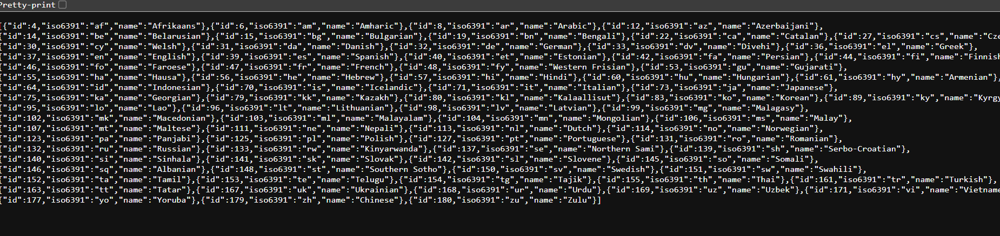
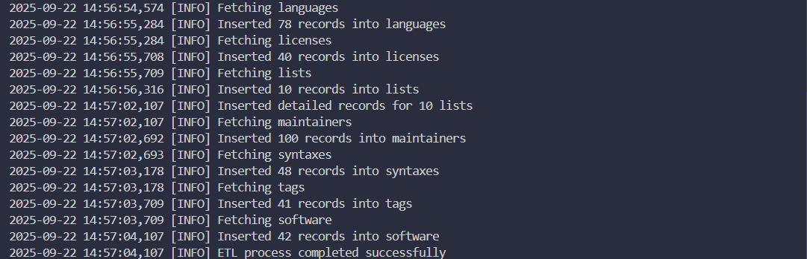
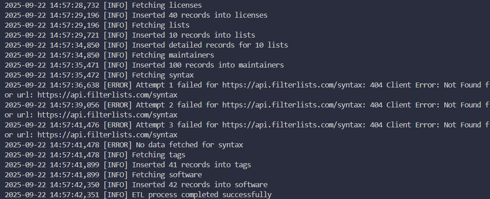
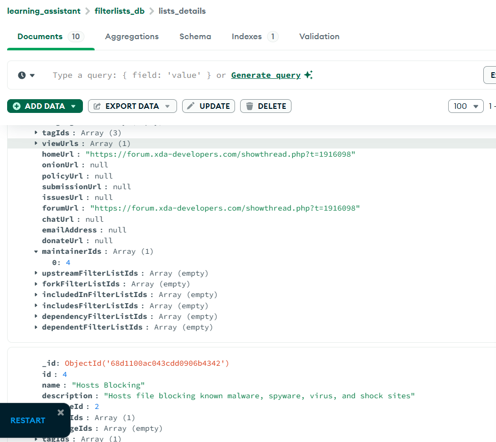
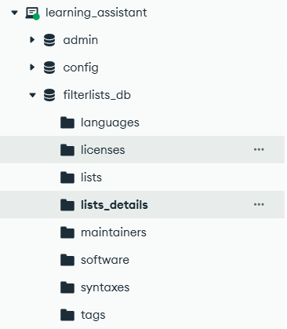

# FilterLists ETL Connector - DEEPAK M - 3122225001024

## Overview

This project implements an ETL (Extract, Transform, Load) pipeline to fetch data from the **FilterLists API**, process it, and store it in MongoDB.  
It follows a modular design using separate **extract, transform, load, and connector** scripts with robust error handling and logging.

---

## Features

- **Modular ETL Workflow**
  - **Extract**: Fetch raw JSON data from FilterLists API endpoints
  - **Transform**: Normalize, slice, and prepare data for storage
  - **Load**: Insert records into MongoDB, with dedicated collections
  - **Connector**: Orchestrates the ETL workflow
- **Error Handling** for invalid responses, empty payloads, and database issues
- **MongoDB Storage Strategy**: Separate collections for each API endpoint
- **Audit Support**: Cleans old data before inserting new records

---

## Guideline: Building and Managing Custom Data Connectors (ETL Pipeline) in Python

1. **Setting Up the Connector Environment**  
   a. Chose FilterLists API: Understood its Base URL, Endpoints, and JSON structures.  
   b. Understood API Documentation: Focused on endpoints like `/languages`, `/licenses`, `/lists`, `/maintainers`, `/syntaxes`, `/tags`, `/software`.

   

2. **Secure Configuration**  
   a. Created a `.env` File Locally: Stored MongoDB connection string.  
   b. Loaded Environment Variables in Code: Used `dotenv` to securely load environment variables.

3. **Design the ETL Pipeline**

   - **Extract**: Connects to API, gets JSON data from the endpoints.
   - **Transform**: Normalizes to a list, applies a maximum of 100 records (10 for detailed `lists`).
   - **Load**: Inserts into MongoDB, cleans old data before fresh inserts.
   - **Special Case**: For `/lists`, fetches **detailed records** (`lists/{id}`) and stores them separately.

   

4. **MongoDB Collection Strategy**

   - Each endpoint stored in its own collection: `languages`, `licenses`, `lists`, etc.
   - Detailed list information stored in `lists_details`.
   - Ensures clear separation of data sources.

   

5. **Iterative Testing & Validation**

   - Tested invalid responses, empty payloads, and MongoDB connectivity issues.
   - Verified consistent data insertion into MongoDB collections.
   - Logs provide transparency for every ETL step.

6. **Git and Project Structure Guidelines**

   - Central Git Repository with personal branch.
   - Added `.env` to `.gitignore` to protect secrets.
   - Documented endpoints, usage, and output samples in README.

     
   

---

## Prerequisites

- Python 3.8+
- MongoDB (local or hosted, e.g., MongoDB Atlas)
- FilterLists API access (public)

---

## Project Structure

```
/JithuMorrisonS-3122225001051/
├── etl_connector.py
├── .env
├── README.md
├── extract.py
├── transform.py
├── load.py
└── .gitignore
```

- **`extract.py`**: Handles API calls
- **`transform.py`**: Normalizes and limits data
- **`load.py`**: Handles MongoDB insertions
- **`etl_connector.py`**: Orchestrates ETL pipeline
- **`.env`**: Stores sensitive credentials
- **`requirements.txt`**: Python dependencies
- **`README.md`**: Documentation

---

## Configuration

The connector reads settings from environment variables. You must create a .env file based on the ENV_TEMPLATE provided.

MONGO_URI="your_mongo_connection_string"
DB_NAME="filterlists_db"
API_BASE="API_URL"

---

## Run the ETL

```bash
python etl_connector.py
```

---

Thank You!
